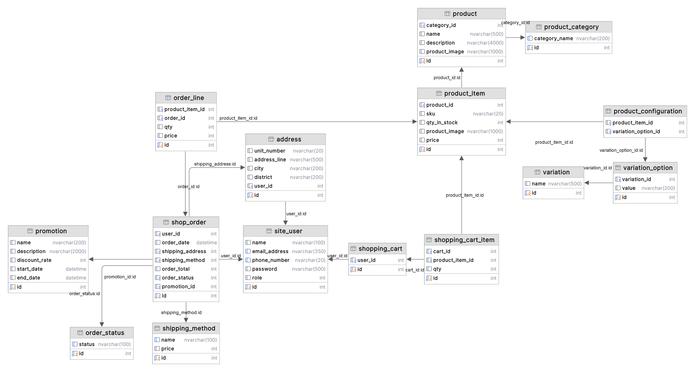

# Hibernate web project
This is the part that connects to SQL Server using Hibernate ORM


[](https://www.microsoft.com/en-us/sql-server/sql-server-2019)
[](https://mvnrepository.com/artifact/org.hibernate/hibernate-core/5.6.15.Final)
[](https://mvnrepository.com/artifact/org.hibernate/hibernate-search-orm/5.11.9.Final)
[](http://www.apache.org/licenses/)

#### Our main and complete project [DuckStore](https://github.com/minhtrong1806/DuckStore.git)

## Data description

This is the data used for any sales website that includes the minimum necessary entities and links

### ERD
- [Detailed description of the database](/sql/DatabaseInfo.docx)
- ERD 

## Setting path
To be able to run this project you need to modify a few things

- [HibernateUtil.java](/src/main/java/utils/HibernateUtil.java)
    ```javascript
    pros.put(Environment.URL, "jdbc:sqlserver://<your_sql_server>;databaseName=<your_database_name>;" +
        "encrypt=true;trustServerCertificate=true;characterEncoding=UTF-8;useUnicode=true");
    pros.put(Environment.USER, "<your_login_name_sqlserver>");
    pros.put(Environment.PASS, "<your_login_password_sqlserver>");
    ```


